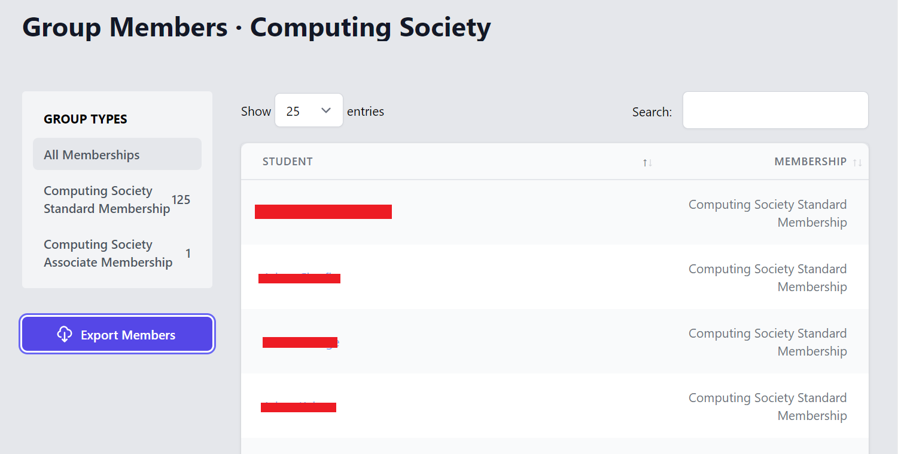
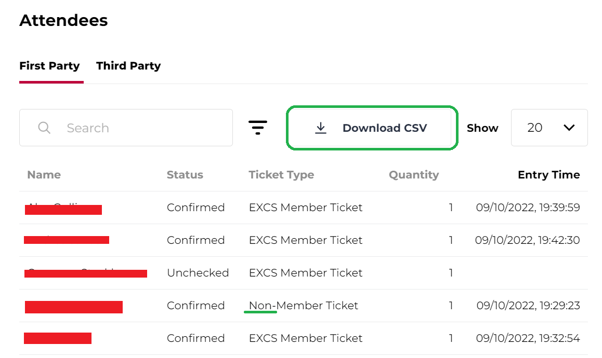

# Membership checker

Really simple command line application that cross references two csv files to find people that have bought members tickets, despite not being members!

To use:
- Obtain the CSV of your members via the society dashboard on the exeter guild, and rename it 'society.csv'

- Obtain the csv of your FIXR Event attendees, and rename it 'event.csv'

- Place both csvs in the same folder as this application

How it works:

People often use their nicknames on FIXR which means they don't always match their student names on the membership csv. Any name that doesn't immediately match will be called a 'suspected liar'.

For each suspected liar, you'll be prompted with all members with surnames that match, and then all members with firstnames that match. Use your brain to see if they actually do own a ticket!

If there are no firstname/surname matches, the application will automatically declare them as a liar. There's a slight issue with this:

'Daniel Day-Lewis' on the student guild may be 'Danny Day' to FIXR. Even though he is innocent, this application will call him a liar. Poor guy.

Things that could break this application:
- CSV column positions changing on either the guild or FIXR
- not using the keyword 'Non' for your non-members tickets

Things I could add:
- The liar's fixr emails to be displayed in the output